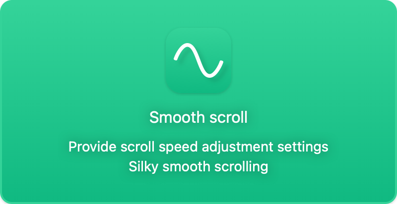
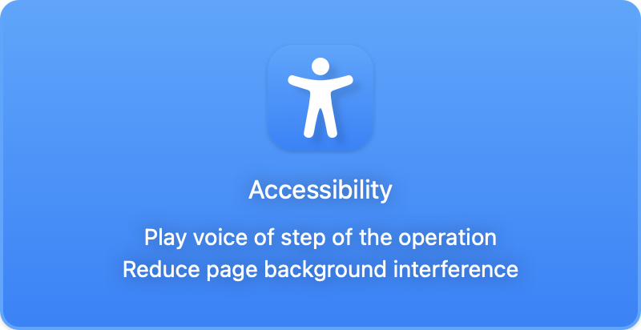
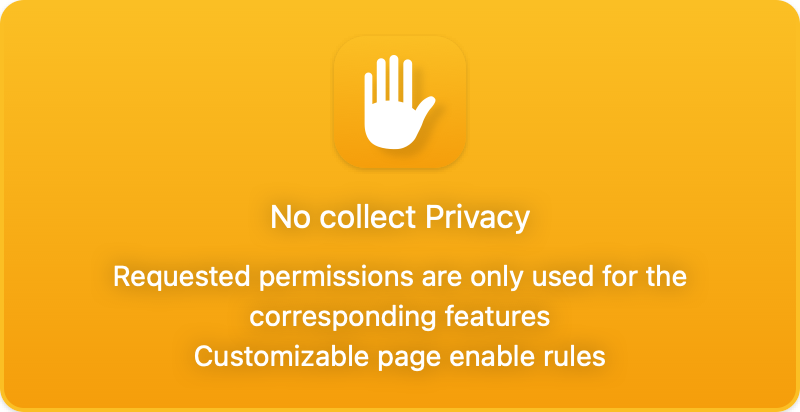

<p align="center">
  
</p>
<h1 align="center"> 
  <strong>Vimkey</strong>
</h1> 
<p align="center">
  Use keyboard control browser jumps, scrolling, switching tabs and more. support Safari, Chrome, Edge.
</p>
<p align="center">
  <a href="https://haojen.github.io/vimkey">Website</a> | <a href="https://haojen.github.io/vimkey/#/support">Document</a> | <a href="https://haojen.github.io/vimkey/#/privacy">Privacy Policy</a>
</p>

<p align="center">
<a href="https://chrome.google.com/webstore/detail/vimkey/eeeandejdamjifbgmmmmonggidbccnnj">
    
</a>
</p>

<p align="center">
<a href="https://itunes.apple.com/app/id1585682577">
    
</a>
<a href="https://itunes.apple.com/app/id1585682577" class="ml-6">
    
</a>
</p>

<hr>  

<p align="center">



</p>

### Keyboard Bindings

#### Navigation

```
J   Switch to pre tab      
K   Switch to next tab
H   Go back in history
L   Go forward in history 
```

#### Scroll

```
k   Scroll up                                   
j   Scroll down                                 
u   Fast scroll up                             
d   Fast scroll down                           
h   Scroll left                                 
l   Scroll right                                
```

#### Open & Search
```markdown
f   To highlight current page all button or links
o   Open A Url From The Tab Or A New Tab (With Shift)
T   Search Tabs
t   Open A New Tab
P   Open The Clipboard's URL In A New Tab
p   Open The Clipboard's URL In The Current Tab
```

#### Tab Control

```markdown
i   TemporarilyDisableModeDescription
gf  Select The Next Frame On Page
yt  Duplicate Current Tab
r   Refresh Page
X   Restore Page
x   Close Current Page
gi  Focus On First Input Field
yy  Copy The Current URL
```

#### Media Control

```markdown
-   Reduce Sound Volume
=   Increase Sound Volume
m   Mute/Unmute
```


### Other

```markdown
?   Get Help
Escape Cancel or blur from input
```


### Thanks

Vimium and Vimari provided me with a lot of inspiration and reference

### About
Copyright © Haojen 2022
