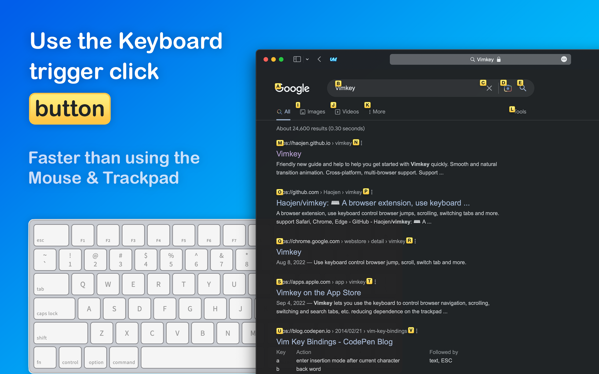
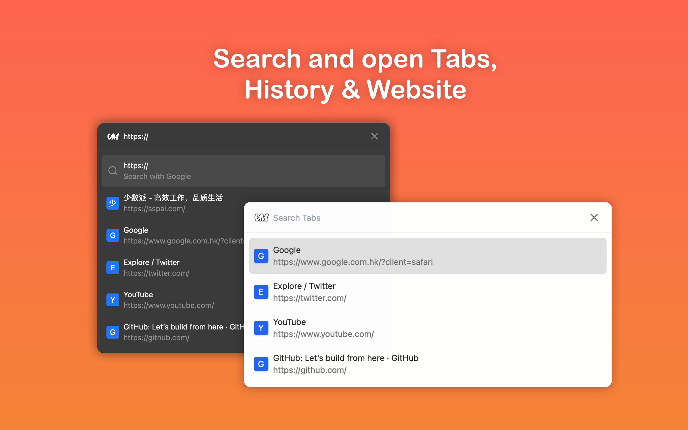
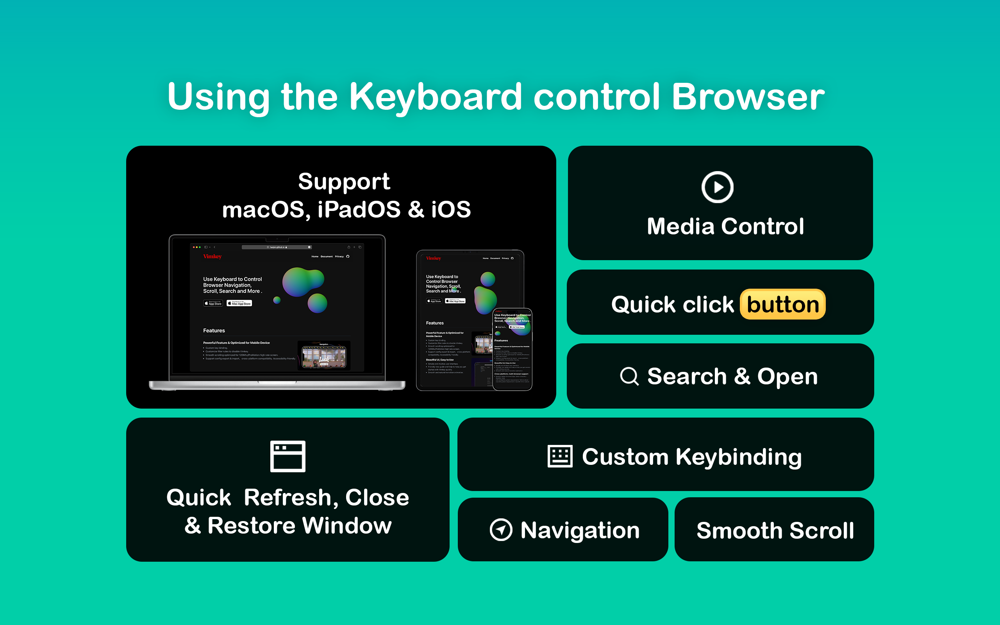

<br/>  
<div align="center">
   
</div>

<h2 align="center">
  <strong>Vimkey</strong>
</h2> 
<h4 align="center">
    Use the Keyboard to control the browser, reducing dependence on the Mouse & Trackpad.
</h3>

<p align="center">
  <span>English</span> | <a href="/README-zh.md">简体中文</a>
</p>

<br>

<p align="center">
    <a href="https://chrome.google.com/webstore/detail/vimkey/eeeandejdamjifbgmmmmonggidbccnnj">
        
    </a>
</p>

<p align="center">
    <a href="https://itunes.apple.com/app/id1585682577">
        
    </a>
    <a href="https://itunes.apple.com/app/id1585682577">
        
    </a>
</p>

<h2>Features</h2>

<div>
    <picture>
        <source media="(max-width: 640px)" srcset="public/assets/logo.png" width="1">
        
    </picture>
    <h3>Powerful Feature</h3>
    <ul>
        <li>Use the keyboard trigger click button or open a link</li>
        <li>Custom key binding.</li>
        <li>Smooth scrolling optimized for 120Mhz/ProMotion high rate screen.</li>
        <li>Support config export & import</li>
        <li>Customize filter rules to disable Vimkey.</li>
        <li>Accessibility friendly.</li>
    </ul>
    <br clear="both"/>
</div>


<div>
    <picture>
        <source media="(max-width: 640px)" srcset="public/assets/logo.png" width="1">
        
    </picture>
    <h3>Beautiful UI, Easy to Use</h3>
    <ul>
        <li>Simple and intuitive user interface.</li>
        <li>Friendly new guide and help to help you get started with Vimkey quickly.</li>
        <li>Smooth and natural transition animation.</li>
        <li>Support Light / Dark theme</li>
    </ul>
    <br clear="both"/>
</div>

<div>
    <picture>
        <source media="(max-width: 640px)" srcset="public/assets/logo.png" width="1">
        
    </picture>
    <h3>Cross-platform, multi-browser support</h3>
    <p align="left">
        <span>Support Safari Chrome Edge. Safari (macOS / iPadOS / iOS) </span>
        <br>
        <br>
        <i>iOS & iPadOS system requirement: 15.0 or above </i>
        <br>
        <i>macOS system requirement: macOS 11.0 or above </i>
    </p>
    <br clear="both"/>
</div>


## Keyboard Bindings

**Navigation**

```
J   Switch to pre tab      
K   Switch to next tab
H   Go back in history
L   Go forward in history 
```

#### Scroll

```
k   Scroll up                                   
j   Scroll down                                 
u   Fast scroll up                             
d   Fast scroll down                           
h   Scroll left                                 
l   Scroll right                                
```

#### Open & Search
```markdown
f   To highlight current page all button or links
o   Open A Url From The Tab Or A New Tab (With Shift)
T   Search Tabs
t   Open A New Tab
P   Open The Clipboard's URL In A New Tab
p   Open The Clipboard's URL In The Current Tab
```

#### Tab Control

```markdown
i   TemporarilyDisableModeDescription
gf  Select The Next Frame On Page
yt  Duplicate Current Tab
r   Refresh Page
X   Restore Page
x   Close Current Page
gi  Focus On First Input Field
yy  Copy The Current URL
```

#### Media Control

```markdown
-   Reduce Sound Volume
=   Increase Sound Volume
m   Mute/Unmute
```

## Other

```
?   Get Help
Escape Cancel or blur from input
```

<h2>Privacy Policy</h2>

When enabling Vimkey, you will be warned that the extension will have access to sensitive information. This access is required for the extension to be able to interact with the website. Vimkey never collects, stores, or transmits any information. It runs entirely locally on your device

in Safari, You can choose to allow just for one day or always and you can also choose to allow just on specific websites or on every website. You can revoke access at any time using Manage Extensions

<h2>Thanks</h2>

Vimium and Vimari provided me with a lot of inspiration and reference

<h2>About</h2>

As an indie developer, this is my only source of income, which is why your support means so much to me, and it's a great encourage.

Star, share, comment, feedback, buy me coffee, etc.

Copyright © HAOZHEN MA 2022
